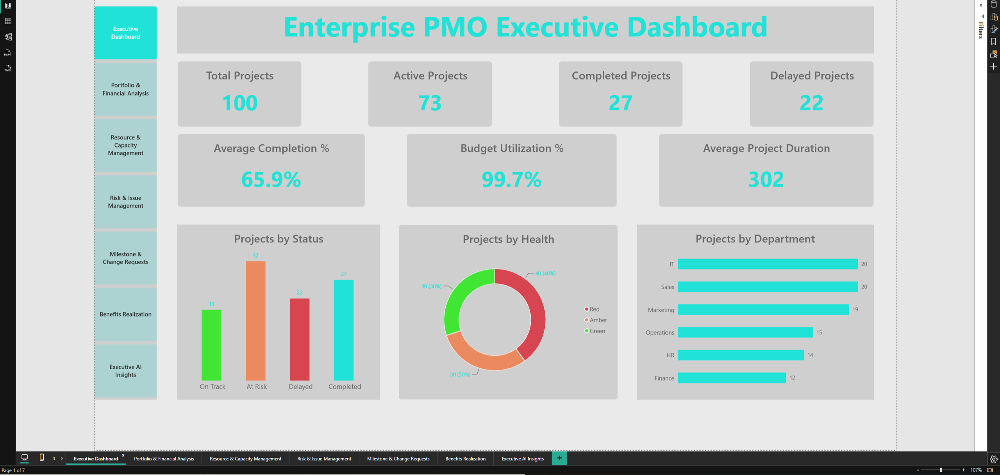
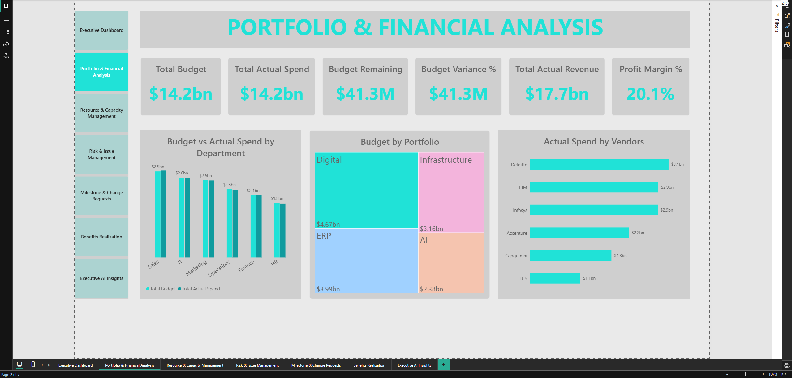
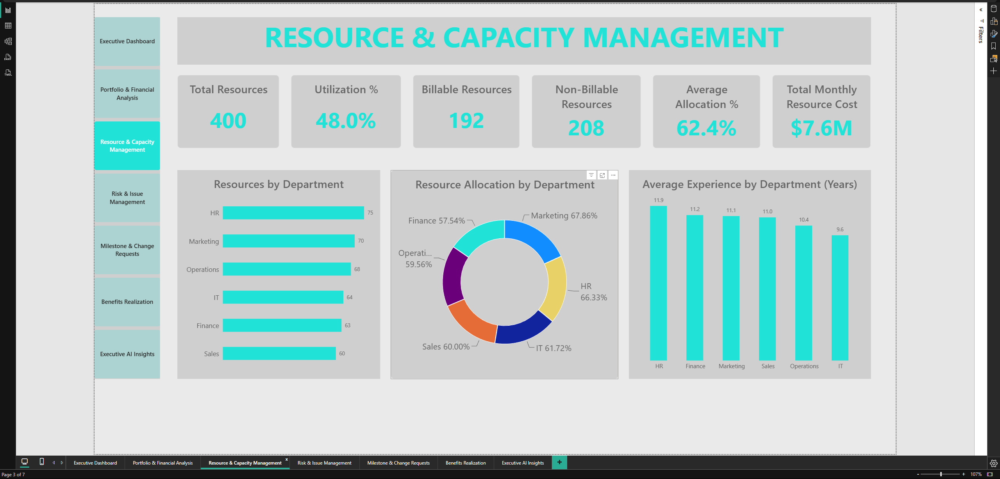
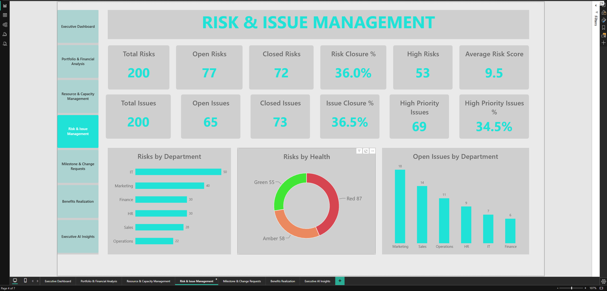
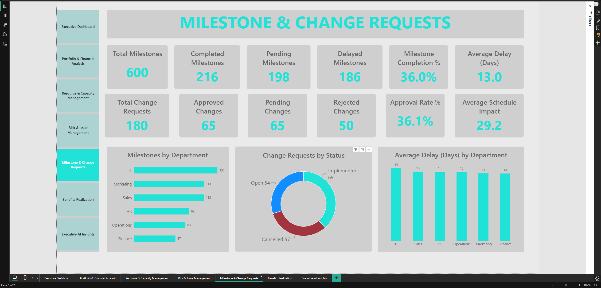
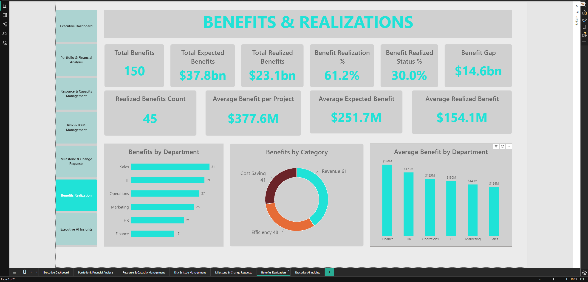
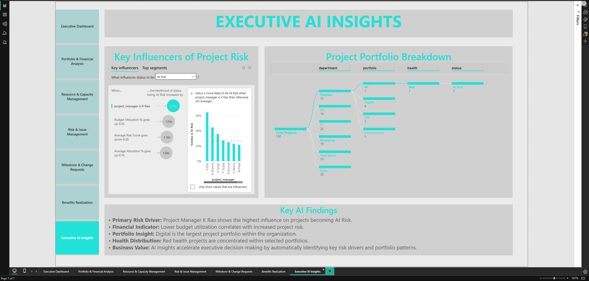

# Enterprise PMO Analytics Dashboard



## Project Overview

The Enterprise PMO Analytics Dashboard is an end-to-end Business Intelligence project developed to analyze and monitor an organization's project portfolio. The solution leverages Microsoft Excel, SQL Server, and Microsoft Power BI to transform raw project data into meaningful business insights for executives and Project Management Offices (PMOs).

The dashboard enables stakeholders to monitor project performance, portfolio health, financial metrics, resource utilization, project risks, milestones, benefits realization, and executive-level AI insights through an interactive and user-friendly reporting solution.

---

## Business Objective

The objective of this project is to provide decision-makers with a centralized dashboard that helps them:

- Monitor overall project portfolio performance
- Track project budgets and actual spending
- Identify project risks and issues
- Evaluate resource allocation and utilization
- Monitor milestones and change requests
- Measure benefits realization
- Generate AI-driven business insights for executive decision-making

---

## Tools & Technologies

- Microsoft Excel
- SQL Server
- Microsoft Power BI
- Power Query
- DAX (Data Analysis Expressions)

---

## Project Workflow

### Step 1 – Data Preparation
- Created an enterprise PMO dataset in Microsoft Excel.
- Structured project, financial, resource, risk, milestone, and benefits data.

### Step 2 – SQL Server
- Imported the dataset into SQL Server.
- Designed relational tables.
- Performed SQL queries for reporting and analysis.
- Created views and optimized queries.

### Step 3 – Data Modeling
- Connected SQL Server to Power BI.
- Built a star schema.
- Configured relationships between tables.

### Step 4 – Data Transformation
- Cleaned and transformed data using Power Query.
- Standardized formats and data types.
- Prepared data for reporting.

### Step 5 – Dashboard Development
- Created DAX measures and KPIs.
- Built interactive reports with slicers, drill-through, and AI visuals.
- Designed executive-friendly dashboards.

---

## Dashboard Pages

### Executive Dashboard

Provides a high-level overview of portfolio performance through KPIs and executive summary visuals.


---

### Portfolio & Financial Analysis

Analyzes budgets, actual spend, cost variance, and financial performance.



---

### Resource & Capacity Management

Monitors resource allocation and utilization.



---

### Risk & Issue Management

Tracks project risks and issues.



---

### Milestone & Change Requests

Tracks milestones and change requests.



---

### Benefits Realization

Measures planned vs realized benefits.



---

### Executive AI Insights

Highlights AI-driven insights using Key Influencers and Decomposition Tree.



---

# Key Features

- Executive KPI Dashboard
- Portfolio Performance Monitoring
- Budget vs Actual Spend Analysis
- Resource Utilization Analysis
- Risk & Issue Tracking
- Milestone Monitoring
- Change Request Analysis
- Benefits Realization Dashboard
- AI Key Influencers
- AI Decomposition Tree
- Interactive Filters & Navigation

---

# Skills Demonstrated

- Business Intelligence
- Data Cleaning
- Data Transformation
- SQL Query Development
- SQL Views
- Data Modeling
- Star Schema Design
- Power Query
- DAX Measures
- Dashboard Design
- Data Visualization
- Executive Reporting
- AI Visual Analytics

---

# Repository Structure

```text
Enterprise-PMO-Analytics-Dashboard
│
├── README.md
├── 01_Documentation
│   └── Company Profile.docx
│
├── 02_Excel_Data
│   └── Enterprise_Digital_Transformation_Portfolio_Dataset.xlsx
│
├── 03_SQL
│   ├── SQL Table Creation.sql
│   ├── Basic SQL Queries.sql
│   ├── Intermediate SQL Queries.sql
│   ├── Advanced SQL Queries.sql
│   ├── SQL Views.sql
│   └── Indexes.sql
│
├── 04_PowerBI
│   └── Enterprise PMO Analytics Dashboard.pbix
│
└── CSV Files
```

---

# Project Outcomes

- Built an end-to-end Business Intelligence solution from data preparation to visualization.
- Demonstrated SQL querying, data modeling, and dashboard development skills.
- Designed executive dashboards that support strategic project portfolio decision-making.
- Applied AI-powered Power BI visuals to identify business patterns and project risk drivers.

---

# Author

**Kanwar Curran Katoch**

CAPM® | Certified ScrumMaster® (CSM®)

Technical Project Manager | Business Intelligence & Data Analytics Enthusiast

---

## Future Enhancements

Potential future improvements include:

- Real-time SQL database integration
- Incremental data refresh
- Row-Level Security (RLS)
- Forecasting and predictive analytics
- Power BI Service deployment
- Mobile-optimized dashboard

---

## Jira Project Management

The project includes a complete Agile/Scrum project-management implementation built in Jira, covering project setup, requirements, backlog management, sprint execution, reporting, and retrospective analysis.

### Jira Project Structure

The Jira project is organized around the following PMO workstreams:

- Project Initiation
- Resource Planning
- Financial Management
- Risk Management
- Issue Management
- Milestone & Schedule Management
- Change Request Management
- Benefits Realization
- Executive Reporting
- Project Closure

### Sprint 1 – Project Foundation

Sprint 1 established the initial project foundation and included:

- 8 stories planned
- 8 stories completed
- 38 story points planned
- 38 story points completed
- Sprint goal achieved
- 100% sprint completion

### Jira Reporting & Analytics

The project includes Jira reporting artifacts demonstrating:

- Active Sprint Board
- Sprint Burndown
- Completed Work Items
- Burnup
- Velocity
- Cumulative Flow Diagram
- Cycle Time
- Deployment Frequency
- Sprint Timeline

### Jira Screenshots

#### Sprint Board


#### Sprint Burndown


#### Completed Work Items


#### Burnup Report


#### Velocity Report


#### Cumulative Flow Diagram


#### Cycle Time


#### Deployment Frequency


#### Sprint Timeline


### Sprint Retrospective

The Sprint 1 retrospective documented:

- What went well
- What could be improved
- Lessons learned
- Delivery and planning observations

This demonstrates practical application of Agile/Scrum delivery, sprint planning, backlog management, delivery tracking, and continuous improvement.